<div align="center">
  <a href="https://github.com/zenpai6996/FlowState-Frontend">
    
  </a>
</div>

<div align="center">
  

 
  <p>Streamline your workflow, boost productivity, and achieve that perfect flow state with our intuitive project management platform.</p>
</div>

<div align="center" >
  
  
  
  
</div>


<div align="center">

  
  [](https://github.com/zenpai6996/FlowState-Backend)

</div>


## ✨ Features


<div align="left">

### 🎯 Core Functionality

| Feature | Description |
|---------|-------------|
| **🏠 Project Dashboard** | Get a bird's-eye view of all your projects |
| **✅ Task Management** | Create, assign, and track tasks with ease |
| **👥 Team Collaboration** | Real-time updates and team communication |
| **📊 Progress Tracking** | Visual progress indicators and completion metrics |
| **⏰ Deadline Management** | Never miss important deadlines again |

### 🔥 Advanced Features

| Feature | Description |
|---------|-------------|
| **📋 Kanban Boards** | Visualize your workflow with drag-and-drop boards |
| **⏱️ Time Tracking** | Monitor time spent on tasks and projects |
| **📢 Activity Feed** | Stay updated with real-time project activities |
| **🔧 Custom Workflows** | Tailor the system to your team's needs |

### 💎 User Experience

| Feature | Description |
|---------|-------------|
| **📱 Responsive Design** | Works seamlessly on desktop, tablet, and mobile |
| **🎨 Multiple Themes** | Choose your preferred theme |
| **🎯 Intuitive Interface** | Clean, modern design for maximum productivity |
| **⚡ Fast Performance** | Optimized for speed and efficiency |

</div>

---

## 🛠️ Tech Stack

- **Frontend Framework:** React 18 with TypeScript
- **Styling:** Tailwind CSS + Custom Components
- **Build Tool:** Vite for lightning-fast development
- **State Management:** React Context API / Redux Toolkit
- **Routing:** React Router v6
- **HTTP Client:** Axios for API communication
- **Form Handling:** React Hook Form with Zod validation
- **Icons:** Lucide React / Heroicons
- **Animations:** Framer Motion

---

## 📸 Screenshots

<div align="center">

| Landing  | Dashboard |
|:--------------:|:------------------:|
|  |  |

| Workspace  | Projects  |
|:---------------:|:------------------:|
|  |  |

| Tasks | Kanban |
|:-------------------:|:------------------------:|
|  |  |

</div>

---

## 🚀 Quick Start

### Prerequisites
- Node.js (v16 or higher)
- npm or yarn package manager

### Installation

1. **Clone the repository**
   ```bash
   git clone https://github.com/zenpai6996/FlowState-Frontend.git
   cd FlowState-Frontend
   ```

2. **Install dependencies**
   ```bash
   npm install
   # or
   yarn install
   ```

3. **Set up environment variables**
   ```bash
   cp .env.example .env.local
   ```
   
   Update the `.env.local` file with your configuration:
   ```env
   VITE_API_BASE_URL=http://localhost:5000/api
   VITE_APP_NAME=FlowState
   ```

4. **Start the development server**
   ```bash
   npm run dev
   # or
   yarn dev
   ```

5. **Open your browser**
   
   Navigate to `http://localhost:5173` to see the application running.

---

## 📦 Available Scripts

| Command | Description |
|---------|-------------|
| `npm run dev` | Start development server |
| `npm run build` | Build for production |
| `npm run preview` | Preview production build |
| `npm run lint` | Run ESLint |
| `npm run lint:fix` | Fix ESLint errors |
| `npm run type-check` | Run TypeScript type checking |

---

## 🏗️ Project Structure

```
FlowState-Frontend/
├── public/                 # Static assets
├── src/
│   ├── components/         # Reusable UI components
│   │   ├── ui/            # Base UI components
│   │   ├── forms/         # Form components
│   │   └── layout/        # Layout components
│   ├── pages/             # Page components
│   ├── hooks/             # Custom React hooks
│   ├── services/          # API services
│   ├── store/             # State management
│   ├── utils/             # Utility functions
│   ├── types/             # TypeScript type definitions
│   └── styles/            # Global styles
├── tests/                 # Test files
└── docs/                  # Documentation
```

---

## 🎨 Design System

FlowState follows a consistent design system with:

- **Colors:** Modern palette with primary, secondary, and accent colors
- **Typography:** Clear hierarchy with readable fonts
- **Spacing:** Consistent spacing scale using Tailwind CSS
- **Components:** Reusable components with consistent styling
- **Icons:** Consistent icon set from Lucide React

---

## 🔧 Configuration


## 📱 Mobile Support

FlowState is fully responsive and provides an excellent experience across all devices:

- **Desktop:** Full-featured interface with advanced functionality
- **Tablet:** Optimized layout for touch interactions
- **Mobile:** Streamlined interface with essential features

---

## 🤝 Contributing

We welcome contributions! Please follow these steps:

1. Fork the repository
2. Create a feature branch (`git checkout -b feature/amazing-feature`)
3. Commit your changes (`git commit -m 'Add amazing feature'`)
4. Push to the branch (`git push origin feature/amazing-feature`)
5. Open a Pull Request


## 📄 License

This project is licensed under the MIT License - see the [LICENSE](LICENSE) file for details.

---


<div align="center">
  <p>⭐ If you found this project helpful, please give it a star!</p>
  <p>Crafted with 💛 by Souharda</p>
</div>


